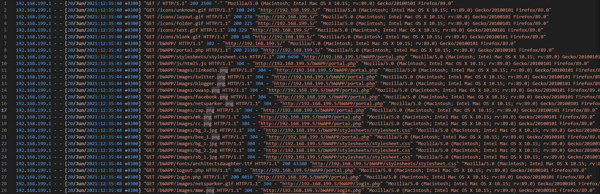
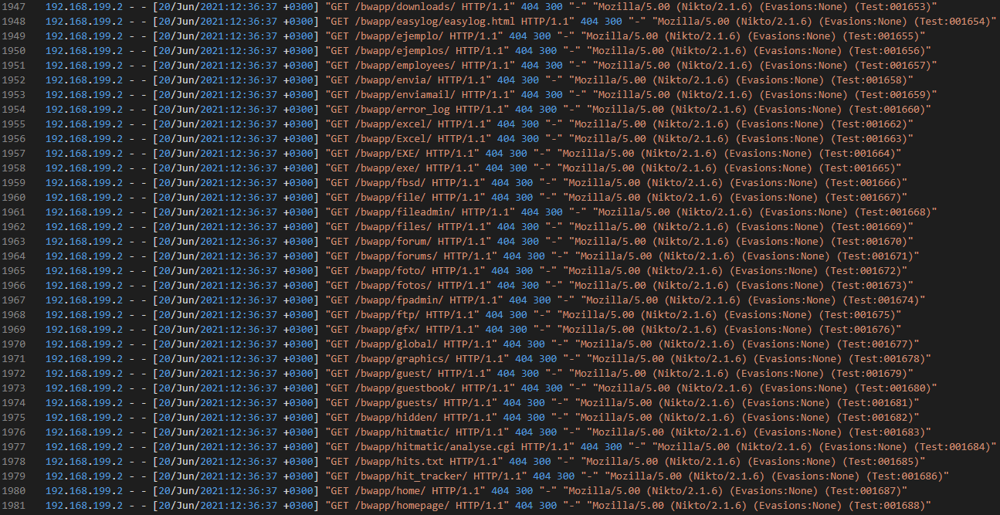
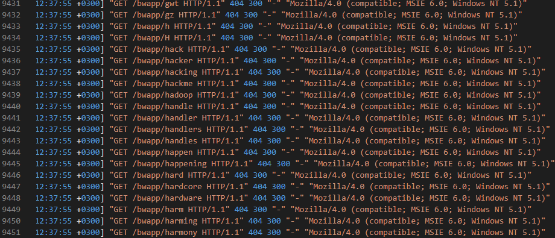
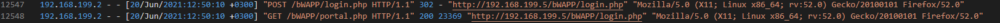
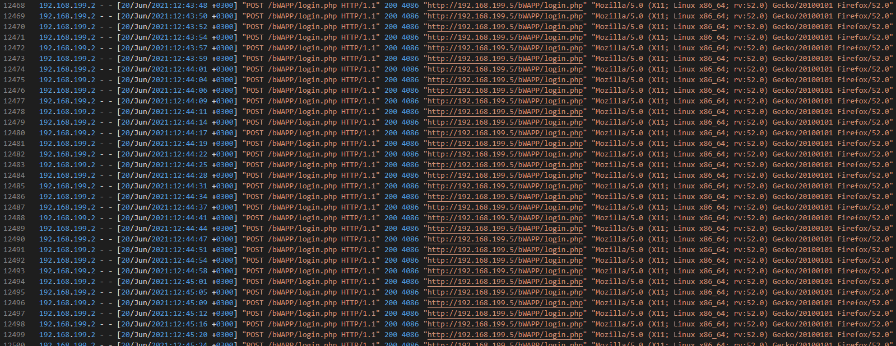
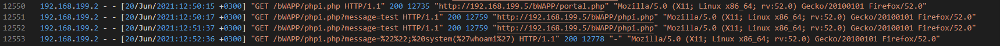
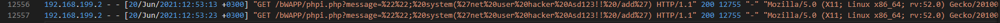
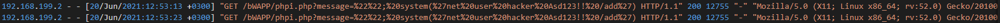

# Disclose The Agent

Write up for the "Disclose The Agent" challenge on letsdefend.io

Challenge can be [found here](https://app.letsdefend.io/challenge/disclose-the-agent/)
if you want to have a go yourself.

Before starting this challenge there is a [prerequisite pcap file (pass = 321)](https://app.letsdefend.io/download/downloadfile/smtpchallenge.zip) that must be downloaded. 

This file only contains web packet logs so it is safe to download onto your main machine, unlike some other challenges on letsdefend, which contain live malware and should only be downloaded onto an isolated enviroment.

Open up the pcap file in any suitable software you wish, I will personally use WireShark, and we can begin with the first question.

## Question 1
```
What is the email address of Ann's secret boyfriend?
```
When dealing with emails in relation to web packet analysis, we should instantly think SMTP. SMTP stands for Simple Mail Transfer Protcol and is the Internet standard protocol for email sending and receiving. We can therefore safely scroll through the logs and begin inspecting the SMTP packets more thoroughly.



Luckily Ann has only sent one email, so we don't have to do any detective work to find out who her secret boyfriend is.

## Question 2
```
What is Ann's email password?
```


We first see an EHLO packet from annlaptop. It is safe to assume this is the ann that is spoken of in the question. We also see an authentication attempt with a username and password being sent. 


Upon doing some research we find out that the default auth command leaves these values in plain text with base64 encoding, this means we can easily decode them, thus giving us the answer to the question (if this is actually Ann's authentication attempt). 

Upon decoding we get the following values 
```sneakyg33k@aol.com``` and ```558r00lz```

The email matches with the email sent to her secret boyfriend, so we can assume that ```558r00lz``` is her password.

## Question 3
```
What is the name of the file that Ann sent to his secret lover?
```


To see any attachements that ann sent, we must take a deeper dive into the compiled SMTP packet of the rendezvous email she sent. 



As you can see, she attached a file called secretrendezvous.docx to her email.

## Question 4
```
In what country will Ann meet with her secret lover?
```

From the previous question, we read Ann's email and now know that her meetup location is in the secretrendezvous.docx file. Luckily, we have captured all of the TCP data coming from her pc and as such we can simply reconstruct the file. We can use a programe called ```Network Miner``` to do this.



Network miner has successfully reconstructed the file (as well as others) from the pcap file we have been using. Upon opening the file we see her meet up location.




## Question 5
```
What is the MD5 value of the attachment Ann sent?

```
To get the MD5 value, we can simply use CMD on the reconstructed file.


